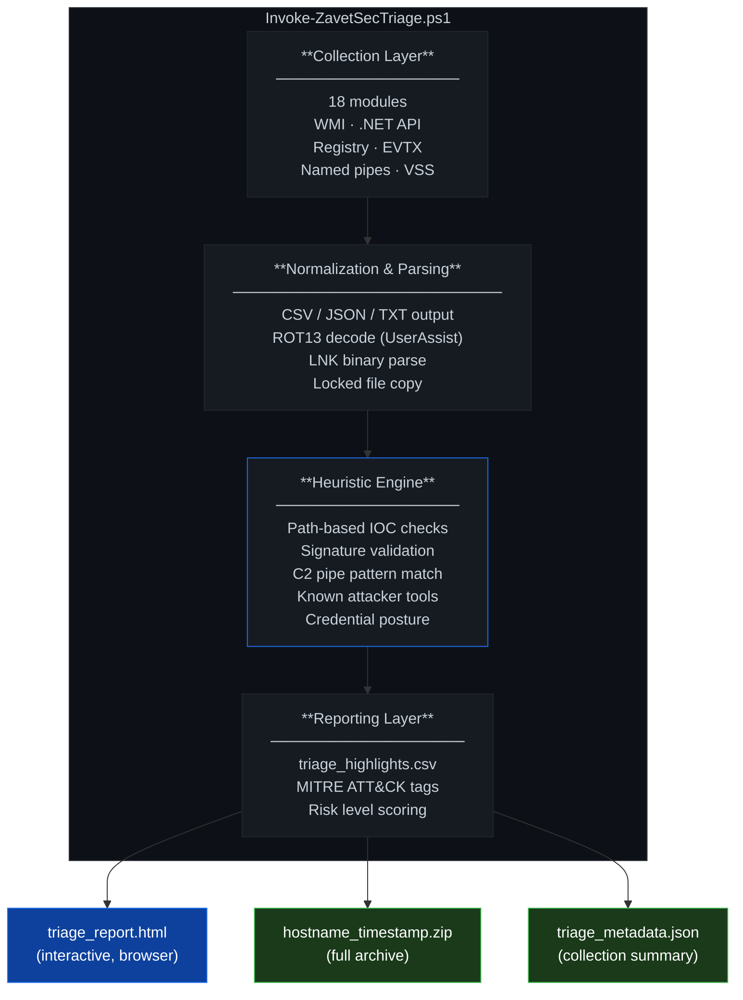

# ZavetSec Triage

```
     ____                  _    ____
    |_  /__ ___ _____ ___ | |_ / __/__ ___
     / // _` \ V / -_)  _||  _\__ \/ -_) _|
    /___\__,_|\_/\___\__| |_| |___/\___\__|

    EXPRESS TRIAGE v1.1  //  DFIR  //  PowerShell 5.1
```

> Zero-dependency live forensics for Windows. One script. No installation. No external binaries. No internet. No persistent footprint.


---


> **TL;DR** — Drop the script on a Windows host, run as Administrator, get a ZIP with 18 artifact categories and an HTML triage report in under 5 minutes. No setup. No internet. No dependencies. No persistent footprint.

---

## Why this tool

Most triage solutions require installing agents, deploying binaries, configuring databases, or maintaining infrastructure. When you are responding to an incident on a live Windows system at 2 AM, none of that is available.

`Invoke-ZavetSecTriage.ps1` is a single PowerShell script that:

- Runs on any Windows system with PowerShell 5.1 (built-in since Windows 8.1)
- Requires no external tools, no internet connection, no pre-installed frameworks
- Collects 18 categories of forensic artifacts in a single pass
- Generates an interactive HTML triage report alongside the raw data
- Packages everything into a timestamped ZIP and exits cleanly

**Design priorities:** speed over completeness, breadth over depth, zero friction over configurability. The goal is to get signal in under 5 minutes on an unknown host — not replace a full forensic acquisition.

---


## Design constraints

Three principles guided every decision in the script:

- **Deterministic output** — the same host collected twice in the same state produces the same CSV columns, the same folder structure, the same JSON keys. Parsing scripts and SIEM ingestion pipelines can rely on this.
- **Minimal system impact** — read-only operations only. No registry writes, no service installation, no process injection, no network connections. Peak RAM under 150 MB. One temporary folder in `%TEMP%`, removed on completion.
- **Analyst-first ergonomics** — every file is named for its content, every suspicious finding has a `Suspicious=True` flag and a MITRE technique ID, and the HTML report requires no tooling to open. The output should be readable by an analyst who has never seen the script before.

---

## Tested on

| OS | Build | Notes |
|----|-------|-------|
| Windows 11 Pro | 22631 (23H2) | Domain-joined and standalone |
| Windows 11 Pro | 22000 (21H2) | |
| Windows 10 Pro | 19045 (22H2) | |
| Windows 10 LTSC | 17763 (2019) | |
| Windows Server 2022 | 20348 | Core and Desktop Experience |
| Windows Server 2019 | 17763 | |
| Windows Server 2016 | 14393 | |

Modules that depend on features not present on older builds (e.g. `Get-LocalUser` on Server 2012 R2) degrade silently — the rest of collection continues.

---


## When NOT to use this tool

Being explicit about limitations is more useful than overpromising.

- **Stealth or covert assessments** — the combination of WMI queries, named pipe enumeration, and registry reads across all user SIDs will trigger behavioral alerts in most EDR products. This is not a covert collection tool.
- **Full forensic preservation** — the script does not acquire memory images, disk images, or forensically sound hive copies. Use WinPmem, FTK Imager, or Magnet RAM Capture for that.
- **Memory-resident threats** — injected shellcode, reflective DLLs, and process hollowing without on-disk artifacts are not directly detected. Combine with a memory acquisition tool for deep process analysis.
- **Large-scale fleet triage** — the script runs one host at a time. For simultaneous triage across hundreds of endpoints, use Velociraptor or EDR-native bulk collection.
- **Legal chain of custody** — this is a first-pass triage tool, not a forensically sound acquisition. For court-admissible evidence, follow a proper acquisition methodology.

---

## Usage scenarios

### Ransomware initial triage
An endpoint is the suspected patient zero. You have RDP access and 10 minutes before the network cable gets pulled.

```
1. Forensics\shadow_copies.csv     -> empty = vssadmin already ran (T1490)
2. Forensics\prefetch.csv          -> KnownThreat = True (Rclone? Cobalt Strike?)
3. Network\tcp_connections.csv     -> IsExternal + Established (C2 still active?)
4. Persistence\scheduled_tasks.csv -> dropper persistence before encryption?
5. Logs\evtx_Security.csv          -> EID 4688 process creation timeline
```

### Suspicious user / insider threat
An account shows anomalous access patterns. The machine is still online.

```
1. Users\kerberos_tickets.txt        -> unusual service names, abnormal validity
2. Users\ps_history_<user>.txt       -> net use, copy, xcopy to network paths?
3. Forensics\lnk_recent.csv          -> recently opened files, share paths
4. Registry\userassist.csv           -> GUI execution history with timestamps
5. Forensics\browser_history_all.csv -> cloud upload, webmail, exfil sites
```

### Unknown initial access
An alert fired but the source is unclear. Host may or may not be compromised.

```
1. Forensics\triage_highlights.csv   -> sort CRITICAL->HIGH, read top 10
2. Processes\processes.csv           -> unsigned binaries in Temp / AppData
3. Persistence\autoruns.csv          -> entries outside known software vendors
4. Network\named_pipes.csv           -> Suspicious = True (C2 framework pipe?)
5. Logs\evtx_Security.csv            -> EID 4624/4625 unusual logon sources
```

---

## Compared to alternatives

| | ZavetSec Triage | KAPE | Velociraptor | CyberTriage |
|--|--|--|--|--|
| External dependencies | None | Collectors + targets | Agent + server | Agent + license |
| Offline operation | ✅ | ✅ | ❌ | ❌ |
| Single-file deployment | ✅ | ❌ | ❌ | ❌ |
| Live HTML report | ✅ | ❌ | ✅ | ✅ |
| PsExec / SYSTEM-compatible | ✅ | ⚠️ | ❌ | ❌ |
| Setup time | 0 min | 30+ min | Hours | Hours |
| Cost | Free | Free | Free / Paid | Paid |

The tool fills the gap between "nothing installed" and "full IR infrastructure". It is not a replacement for Velociraptor or KAPE at scale — it is what you run when neither is available.

---

## Architecture



**Collection layer** reads from live system only — WMI, .NET APIs, registry, filesystem. No process injection, no kernel interaction, no network calls.

**Heuristic engine** runs inline during collection: path-based IOCs, signature validation, C2 pipe pattern matching, known attacker tool detection, credential security posture checks.

**Reporting layer** runs last: consolidates all findings into `triage_highlights.csv` with severity and MITRE ATT&CK IDs, generates the HTML report, packages the ZIP.

---

## Performance & footprint

Measured on a typical enterprise endpoint (Windows 11, 8 GB RAM, SSD, ~120 running processes):

| Metric | Value |
|--------|-------|
| Total runtime | ~3–5 minutes (varies with EVTX volume) |
| Archive size | 5–80 MB (dominated by raw EVTX copies) |
| Peak RAM usage | < 150 MB (PowerShell process) |
| Disk writes | Output ZIP only — temp folder in `%TEMP%`, removed on completion |
| Child processes | `arp`, `route`, `klist` — standard Windows utilities |
| Network activity | None |
| Registry writes | None |
| Service installation | None |

The dominant runtime cost is raw EVTX copying. On systems with large Security logs this can extend to 8–10 minutes. All other modules complete in under 60 seconds combined.

---

## OPSEC & detection profile

This section is for **blue teams** evaluating the tool and for **operators** who need to understand what artifacts the script leaves.

**What the script does on the system:**
- Reads `\\.\pipe\` directory and queries `Win32_Pipe` WMI class
- Calls `Get-NetTCPConnection`, `Get-NetFirewallRule`, `Get-NetUDPEndpoint`
- Reads registry hives including `HKCU` for all users via SID enumeration
- Spawns `arp.exe`, `route.exe`, `klist.exe` as child processes of PowerShell
- Creates a temporary folder in `%TEMP%`, writes collected data, then ZIPs and removes it
- Queries `Win32_Process`, `Win32_Service`, `Win32_ShadowCopy` via WMI

**Artifacts created:**
- One ZIP file in the specified output directory
- PowerShell process visible in task manager during execution
- Windows event log entries: EID 4688 (process creation) if process auditing is enabled
- If script block logging is active: EID 4104 will capture the full script source

**What the script does NOT do:**
- Does not write to registry
- Does not install services or scheduled tasks
- Does not make network connections
- Does not inject into processes
- Does not modify any existing files

**EDR behavioral profile:** the combination of WMI `Win32_Pipe` queries, named pipe enumeration, and registry enumeration across all user SIDs will trigger behavioral alerts in most EDR products. Plan accordingly if running on a monitored host during a covert assessment.

---

## HTML report preview

> **Screenshot:** run the script on any Windows host and open `triage_report.html` from the output ZIP — the report renders entirely offline. A demo GIF is planned for the next release.

The HTML report is a self-contained single file — no server, no external resources, opens in any browser on an isolated analyst workstation.

**Header** — host, OS, risk badge, collection metadata

| CRITICAL | HIGH | MEDIUM | TOTAL | PROCESSES | EXT CONN |
|:--------:|:----:|:------:|:-----:|:---------:|:--------:|
| 0 | 7 | 4 | 11 | 125 | 33 |

**Tabs** — Findings · System · Processes · Network · Persistence · MITRE ATT&CK

**Findings table** (sample output):

| Category | Severity | Description | MITRE |
|----------|----------|-------------|-------|
| Credentials | `HIGH` | WDigest plaintext caching ENABLED | T1003.001 |
| Credentials | `MEDIUM` | LSA Protection (PPL) not enabled | T1003.001 |
| Network | `HIGH` | Suspicious external conn: curl.exe → 185.220.x.x:443 | T1071 |
| Persistence | `HIGH` | IFEO debugger hijack: sethc.exe → cmd.exe | T1546.012 |
| Forensics | `HIGH` | No VSS shadow copies found | T1490 |

Each finding links to the relevant source file in the archive. MITRE technique IDs link to [attack.mitre.org](https://attack.mitre.org).

---

## Collection modules

| # | Module | Files produced | Key capability |
|---|--------|----------------|----------------|
| 1 | System Baseline | `System\sysinfo.json`, `hotfixes_last20.csv`, `installed_software.csv` | OS, domain, uptime, hotfixes. RAT keywords auto-flagged (AnyDesk, ngrok, RustDesk, ScreenConnect…) |
| 2 | Running Processes | `Processes\processes.csv` | SHA256, Authenticode signature, parent chain, cmdline. Masquerade detection. `Suspicious=True` column |
| 3 | Network State | `Network\tcp_connections.csv`, `udp_endpoints.csv`, `named_pipes.csv`, `dns_cache.csv`, `arp_table.txt` | `IsExternal` flag, process path per connection. UDP with owning process. Named pipes with `OwnerPID` + `ProcessPath`. Known C2 pipe patterns auto-flagged |
| 4 | Persistence | `Persistence\autoruns.csv`, `scheduled_tasks.csv`, `services.csv`, `wmi_subscriptions.json` | Run keys, Winlogon, IFEO, AppInit DLLs, LSA SSP, BootExecute, COM hijacks (HKCU), startup folders, WMI subscriptions |
| 5 | User Accounts | `Users\local_users.csv`, `local_groups.csv`, `logon_sessions.txt`, `kerberos_tickets.txt` | Logon session types, Kerberos ticket validity. Golden/Silver Ticket heuristic. Dollar-sign account detection |
| 6 | PowerShell Artifacts | `Users\ps_history_<user>.txt`, `ps_language_mode.txt` | History for all user profiles. CLM status. Suspicious commands auto-flagged |
| 7 | Event Logs | `Logs\evtx_*.csv`, `Logs\*.evtx` | 13 targeted log channels, 50+ Event IDs as CSV. Full raw EVTX export for Chainsaw / Hayabusa |
| 8 | Prefetch | `Forensics\prefetch.csv` | Execution evidence. 50+ known attacker tools auto-flagged (Mimikatz, CrackMapExec, Rubeus, BloodHound, Chisel…) |
| 9 | File Activity | `Forensics\lnk_recent.csv` | Pure .NET LNK binary parser — no COM, no Shell.Application |
| 10 | Registry Forensics | `Registry\userassist.csv`, `muicache.csv`, `typedurls.csv`, `recentdocs.csv` | UserAssist with ROT13 auto-decode, MUICache, TypedURLs |
| 11 | Credential Security | `Forensics\credential_security.json` | WDigest plaintext caching, Credential Guard, LSA PPL |
| 12 | Configuration | `Config\firewall_rules_inbound.csv`, `firewall_rules_outbound.csv`, `hosts_file.txt`, `ads_scan.csv` | Firewall rules with `Action` column (Allow/Block). AV-domain redirect detection in hosts file. ADS scan |
| 13 | Shadow Copies | `Forensics\shadow_copies.csv` | VSS enumeration. Absence auto-flagged as HIGH (T1490) |
| 14 | Browser History | `Forensics\browser_history_all.csv` | 16 browsers, all user profiles. With `sqlite3.exe`: titles + visit counts + timestamps. Without: URL regex fallback |
| 15 | BITS Jobs | `Forensics\bits_jobs.csv` | Non-Microsoft download URLs to Temp/AppData auto-flagged as HIGH (T1197) |
| 16 | Clipboard | `Forensics\clipboard.txt` | Credential pattern detection (passwords, tokens, API keys, SSH/AWS keys) |
| 17 | Metadata & Summary | `triage_metadata.json`, `Forensics\triage_highlights.csv` | All findings with severity and MITRE IDs. Risk level: LOW / MEDIUM / HIGH / CRITICAL |
| 18 | HTML Report | `triage_report.html` | Interactive single-file report. Tabbed views. Opens in any browser |

---

## Quick start

```powershell
# Run as Administrator — local collection
.\Invoke-ZavetSecTriage.ps1

# Specify output directory
.\Invoke-ZavetSecTriage.ps1 -OutputDir C:\DFIR

# Remote collection via PsExec — runs as SYSTEM, no interaction required
psexec \\TARGET -s -d powershell.exe -NonInteractive -WindowStyle Hidden `
    -ExecutionPolicy Bypass -File "\\share\Invoke-ZavetSecTriage.ps1" `
    -OutputDir "\\share\output"
```

Output: `<hostname>_<timestamp>.zip` in the specified directory (default: script directory).

**Optional:** place `sqlite3.exe` alongside the script to enable full browser history parsing (URL + title + visit count + timestamps). Download: [sqlite.org/download.html](https://sqlite.org/download.html)

---

## Output structure

```
HOSTNAME_20260319_091103.zip
├── triage_report.html              ← open this first
├── triage_metadata.json            ← collection summary, risk level
├── System\
│   ├── sysinfo.json
│   ├── hotfixes_last20.csv
│   └── installed_software.csv
├── Processes\
│   └── processes.csv               ← SHA256, signature, Suspicious column
├── Network\
│   ├── tcp_connections.csv         ← IsExternal flag, ProcessPath
│   ├── tcp_established.csv
│   ├── tcp_listening.csv
│   ├── udp_endpoints.csv           ← ProcessName + ProcessPath
│   ├── named_pipes.csv             ← OwnerPID + ProcessName + ProcessPath
│   ├── dns_cache.csv
│   └── arp_table.txt
├── Persistence\
│   ├── autoruns.csv                ← consolidated: Run keys, Winlogon, IFEO, COM…
│   ├── scheduled_tasks.csv
│   ├── services.csv
│   └── wmi_subscriptions.json
├── Users\
│   ├── local_users.csv
│   ├── local_groups.csv
│   ├── logon_sessions.txt
│   ├── kerberos_tickets.txt
│   └── ps_history_<user>.txt
├── Logs\
│   ├── evtx_Security.csv
│   ├── evtx_System.csv
│   ├── evtx_*.csv                  ← one per targeted log channel
│   └── *.evtx                      ← full raw copies for Chainsaw / Hayabusa
├── Forensics\
│   ├── triage_highlights.csv       ← all findings, sort by Severity
│   ├── prefetch.csv
│   ├── browser_history_all.csv
│   ├── shadow_copies.csv
│   ├── credential_security.json
│   └── bits_jobs.csv
├── Config\
│   ├── hosts_file.txt
│   ├── firewall_rules_inbound.csv  ← Action: Allow / Block
│   ├── firewall_rules_outbound.csv ← Action: Allow / Block
│   └── ads_scan.csv
└── Registry\
    ├── userassist.csv
    ├── muicache.csv
    ├── typedurls.csv
    └── recentdocs.csv
```

---

## Triage workflow

```
1. triage_report.html                     → open in browser for immediate visual overview
2. Forensics\triage_highlights.csv        → sort Severity DESC — start at CRITICAL
3. Processes\processes.csv                → filter Suspicious = True, check SHA256 on VT
4. Network\tcp_connections.csv            → filter IsExternal = True, State = Established
5. Persistence\autoruns.csv               → look for unknown entries in Temp / AppData
6. Persistence\scheduled_tasks.csv        → check non-Microsoft task paths and authors
7. Logs\ (Chainsaw or Hayabusa)           → Sigma rule scan against raw EVTX
8. Config\firewall_rules_inbound.csv      → filter Action = Allow, unexpected programs
9. Forensics\shadow_copies.csv            → empty = possible ransomware (T1490)
10. Forensics\prefetch.csv                → filter KnownThreat = True
```

Batch EVTX analysis:
```
chainsaw hunt Logs\ --sigma rules\ --mapping mapping.yml
hayabusa csv-timeline -d Logs\ -o timeline.csv
```

---

## MITRE ATT&CK coverage

Findings are automatically tagged with technique IDs and surfaced in both `triage_highlights.csv` and the HTML report.

| Tactic | Techniques |
|--------|-----------|
| Persistence | T1053.005, T1547.001, T1547.004, T1547.005, T1546.003, T1546.010, T1546.012, T1546.015 |
| Credential Access | T1003.001, T1552, T1558.001 |
| Defense Evasion | T1036.001, T1036.005, T1197, T1490, T1562.001, T1562.004, T1564.004 |
| Execution | T1059, T1059.001 |
| C2 / Exfiltration | T1071, T1071.001 |
| Remote Access | T1219 |

---

## Requirements

| Requirement | Detail |
|-------------|--------|
| PowerShell | 5.1+ (built-in on Windows 8.1 / Server 2012 R2 and later) |
| Privileges | Local Administrator recommended — some modules degrade silently without |
| Network | None — fully offline |
| Dependencies | None — zero external binaries |
| `sqlite3.exe` | Optional — full browser history with titles and timestamps |

---

## Changelog

### v1.1
- Added interactive HTML triage report (`triage_report.html`) — dark theme, tabbed views, MITRE ATT&CK tags linked to attack.mitre.org
- Firewall collection: added `Action` column (Allow/Block), removed pre-filter — all enabled rules now collected in both directions
- Named pipes: added `OwnerPID`, `ProcessName`, `ProcessPath` via `Win32_Pipe` WMI with process list fallback
- UDP endpoints: added `ProcessName` and `ProcessPath` columns
- Browser history: removed raw SQLite DB copies — CSV output only, smaller archives
- Scheduled tasks: fixed UTF-8 BOM artifact (`п»ї`) in Excel on Russian Windows locale
- Archive naming: `<hostname>_<timestamp>.zip` (removed `ZavetSec_` prefix)
- Console output: `[+]` success lines green, `[!]` warning lines yellow, `[-]` info lines gray

### v1.0
- Initial release — 17 collection modules

---

### Release notes

- **Versioning:** `MAJOR.MINOR` — minor versions add modules or enrich existing output columns, major versions indicate breaking changes to archive structure or folder layout
- **Backward compatibility:** CSV column names and folder structure are kept stable within a major version — scripts or SIEM pipelines parsing the output will not break on minor updates
- **PS 5.1 guarantee:** every release is tested on PowerShell 5.1. No features requiring PS 7+ will be introduced without a fallback path
- **Zero-dependency guarantee:** the core script will never require external binaries to produce output. Optional enhancements (sqlite3.exe) remain strictly opt-in

---

## Roadmap

The script is functional and stable. Planned improvements:

- [ ] `LITE` mode flag — skip raw EVTX copy for faster, smaller collection
- [ ] Amcache / ShimCache module — additional execution evidence
- [ ] MFT timeline sampling — recent file creations in high-risk directories  
- [ ] Expandable IOC lists — external config file for custom pipe patterns, attacker tool names, suspicious domains
- [ ] JSON-only output mode — for integration with SIEM ingestion pipelines

Contributions welcome — see below.

---

## Contributing

The most useful contributions:

- **New attacker tool names** for the Prefetch flagging list (`$knownAttackerTools`)
- **New C2 named pipe patterns** (`$c2PipePatterns`) — Sliver, Havoc, Brute Ratel signatures
- **Bug reports** — unexpected errors on specific Windows versions or domain configurations
- **False positive reports** — legitimate software triggering `Suspicious = True`

Open an issue or submit a pull request. Keep changes PS 5.1 compatible and zero-dependency.

---

## License

MIT License — see [LICENSE](LICENSE) for details.

---

*ZavetSec — built for field DFIR, not demos.*
